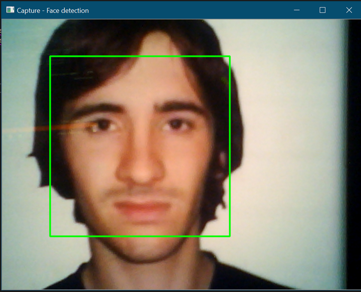
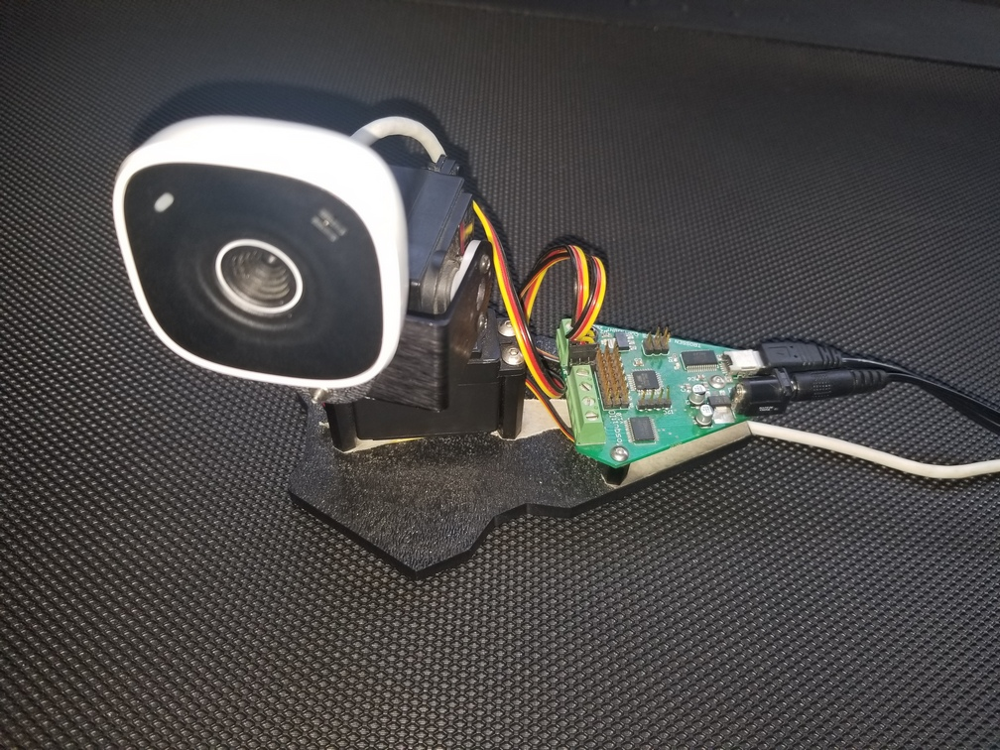
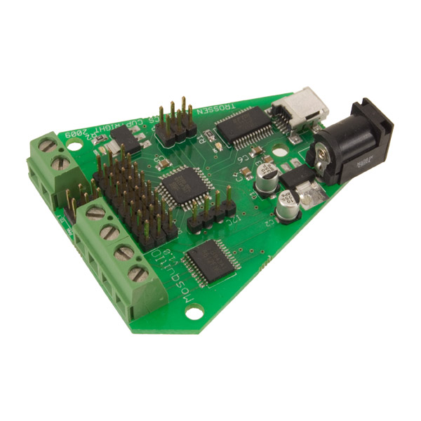

# OpenCV Face Tracking

## Requirements
* Visual Studio 2017  
* OpenCV v4.3.0

## Hardware Requirements
* [MosquitIO](https://www.trossenrobotics.com/p/mosquitIO-pan-tilt-microcontroller.aspx) / Arduino*  
* 2 Servo Motors

  

  

  

## MosquitIO
MosquitIO is a micro controller, that has pins to connect two servo motors. The micro controller provides a simple protocol to control the servo motors. It is simple to implement the same interface and interaction with an Arduino.

### MosquitIO Specs 

| Characteristic  | Value     |
|-----------------|-----------|
| Microprocessor  | ATmega168 | 
| Supply Voltage  | 5-6v      |
| Clock Frequency |	8 Mhz     |
| Analog I/Os 	  | 3         |
| Digital I/Os 	  | 5         |
| PWM Ports 	  | 2         |
| Motor Driver Channels | 2 |
| Maximum Current per Channel | 1 Amp |
| Solid State Relay (SSR)Ports | 1 |
| SSR Specifications | 42V@5A(14A peak) |
| Programming Interface | ISP |

### Interface
Comunicating with MosquitIO is very simple, it takes a 13 byte packet formatted as following

MosquitIO Packet  structure
```
uint8_t cHeader;     // 255: header, this begins a packet and must always be sent.
uint8_t cByteCount;  // Number of bytes: total number of bytes (not including the header or this byte) to be sent. There is always 11 in this struct
uint8_t cTilt;       // Tilt servo: 0-255 for -100 to 100 degrees (approximately)
uint8_t cPan;        // Pan servo: 0-255 for -100 to 100 degrees (approximately)
uint8_t cMotor1;     // Motor 1: 0 - 255 0 = full backwards, 128 = stop, 255 = full forwards
uint8_t cMotor2;     // Motor 2: 0 - 255 0 = full backwards, 128 = stop, 255 = full forwards
uint8_t cMotorRelay; // Motor Relay: 0-1, On/Off Solid State Relay – Supplies Input Voltage
uint8_t cdigitalIO1; // Digital IO 1: we set inputs to high since high is the default stable state
uint8_t cdigitalIO2; // Digital IO 2: we set inputs to high since high is the default stable state
uint8_t cdigitalIO3; // Digital IO 3: we set inputs to high since high is the default stable state
uint8_t cdigitalIO4; // Digital IO 4: we set inputs to high since high is the default stable state
uint8_t cdigitalIO5; // Digital IO 5 we set inputs to high since high is the default stable state
uint8_t cMode;       // Mode: sending > 0 will reset the controller into JOYSTICK mode.
```

Most of the time you will only need to change the "Tilt" and "Pan" values, to move towards the object your interested to tack.

## Code
Even when using a MosquitIO micro controller  the code might not work for you and some code changes will be needed

Most of the changes will be in the main function here is a list of what you might need to change

* Capture device index
  * If you have a single web cam attached, mostly you should be good, if more than one, you might need to change the device index passed to the webcam object.

```
int main(int argc, const char** argv)
{
	...
	WebCam webcam(0);
    ...
```

* Micro-controller port
  * You want to make sure that your MosquitIO / Arduino port is correct. It should be easy to figure out if you go though the COM port in your device manger.
```
int main(int argc, const char** argv)
{
    ...
	MosquitIO mio(L"COM4");
    ...
```
* Arduino
  * If you are using an Arduino, you will need to implement the code that would read the packet sent and set the servo motors to respond accordingly. MosquitIO Micro-controller is open source, which should help allot in getting and Arduino to work.

## Reference
[OpenCV](https://docs.opencv.org/master/db/d28/tutorial_cascade_classifier.html)  
[MosquitIO Pan & Tilt Microcontroller](https://www.trossenrobotics.com/p/mosquitIO-pan-tilt-microcontroller.aspx)  
